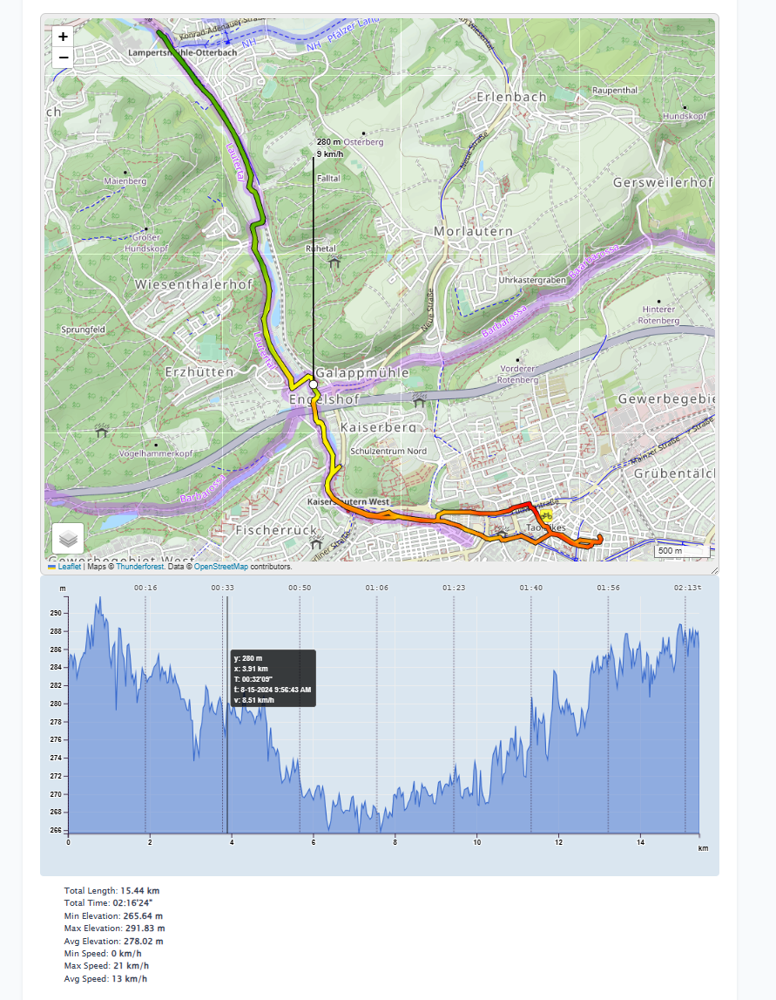
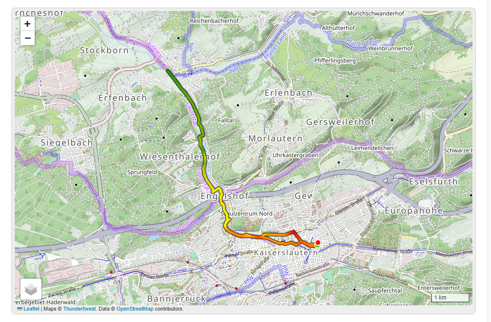
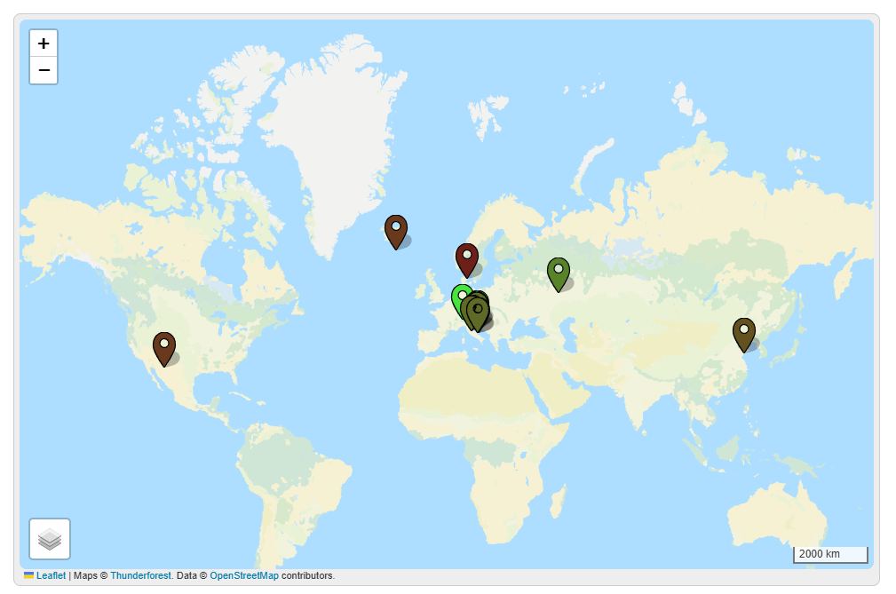

# hugo-mod-leaflet: Leaflet integration for Hugo

This module provides a number of Hugo shortcodes for easy embedding of maps into Hugo-based websites.

## Setup

In order to use it, you need to include the initial scripts/css into HEAD, so add something like this into your `layouts/partials/head.html` (assuming you have it, if not, please refer to your theme documentation how to add extra stuff in head)

```go-html-template
{{ if .HasShortcode "leaflet-map" }}
    {{ partial "leaflet-loader" . }}
{{ end }}
```

This will include theme's CSS and JS as well as [Leaflet](https://leafletjs.com/index.html) itself and [leaflet-elevation](https://github.com/Raruto/leaflet-elevation). It doesn't have any other dependencies (for example, no jQuery).

Because both `leaflet` and `leaflet-elevation` are directly included in this repo, you have two options:
1. Remove the usage of the local files and include leaflet / leaflet-elevation from CDN.
2. Use local copy, but then you need to modify `srcFolder` parameter in `hugo-leaflet.js`, because that's how 
 leaflet-elevation finds D3 (visualisation library). It needs to be full URL, but default it's `http://localhost:1313/assets/leaflet-elevation/src/`

### Configuration options

To avoid hardcoding API key for Thunderforest layer, you can put it in Hugo config:

```yaml
params:
  modules:
    leaflet:
      thunderforest:
        apiKey: YOUR_API_KEY_GOES_HERE

```

```toml
# in params.toml
[modules.leaflet]
    [modules.leaflet.thunderforest]
      apiKey = "YOUR_API_KEY_GOES_HERE"
```

This is inspired by the improvement in original repo with custom layers ([link](https://gitlab.com/mrubli/hugo-mod-leaflet/-/commit/1c8bce4a66cab2ab0aee2ba4542a52536a5e46db)).


## Examples

Here's an example use of the map shortcodes provided by hugo-mod-leaflet:

```go-html-template


    

    

```

And below is how this might render:



If you do not want elevation graph, then omit `leaflet-elevation-profile`:

```go-html-template


    


```





### Posts with coordinates map example
It also can be used to display markers and, as an incredibly cool feature, creating a map of your posts with different colored markers.

Add coordinates to your posts (`.md` files):
```html
---
OSM_geo_data:
  - 50.119321,5.991232
---
```

Create some custom shortcode like `mymap.html`. It should check all posts which are visible and have `osm_geo_data` parameter, and then create a marker for it with some information. 
```html

{{ $uniqueMapId := (printf "%s:%d" .Page.File.UniqueID .Parent.Ordinal) | md5 | safeJS }}

{{- range .Site.Sites -}}
    {{- $pages := where .RegularPages "Params.hidden" "!=" true -}}
    {{- range $pages -}}
		{{- $page := . -}}
		{{- if .Params.osm_geo_data -}}
			{{- $cover := .Params.image | default "" -}}
			{{- range .Params.osm_geo_data -}}
				{{- $parts := split . "," -}}
				{{- $lat := index $parts 0 -}}
				{{- $lon := index $parts 1 -}}
				{{ $dateHuman := $page.Date | time.Format ":date_medium" }}
                {{- $popupText := printf "<div><h3>%s</h3>(%s)%s<p>%s</p><a href='%s' target='_blank'>Go to</a></div>" 
    $page.Title 
    $dateHuman
    (cond (ne $cover "") (printf "" $cover) "")
    $page.Description 
    $page.Permalink 
-}}
                <script>map_options_{{ $uniqueMapId }}.markers.push({ lat: {{ $lat }}, lon: {{ $lon }}, popup: "{{$popupText}}", year: "{{$page.Date.Year}}" })</script>
			{{- end -}}
		{{- end -}}
    {{- end -}}
{{- end -}}


```

Note `year: "{{$page.Date.Year}}" })` parameter that we add here to `map_options.markers[]`. This is used in `hugo-leaflet.js` to create different colors for markers.

And put it all together in some new page:

```html



```




## Documentation

The current shortcode documentation is contained at the top of [leaflet-map.html](layouts/shortcodes/leaflet-map.html) but is reproduced here for convenience:

### Syntax summary

```go-html-template


	

	

	

	

	


```

### Map options

```
centerLat/centerLon:
	Center point coordinates of the map as decimal values. Optional iif tracks or markers are given.
zoom:
	Zoom level of the map. Optional iif tracks or markers are given.
width:
	Width of the map, including CSS units (e.g. "50%", "300px").
	Optional, defaults to "auto".
height:
	Height of the map, including CSS units (e.g. "50%", "300px").
	Optional, defaults to "50vh".
resizable:
	Boolean value indicating whether the map should be drag & drop resizable.
	Optional, defaults to true.
maximizable:
	Boolean value indicating whether the maximize button should be displayed.
	Optional, defaults to true.

```

### Layer options

```
id:
	Name of the layer. Supported base layers:
	- org.openstreetmap.standard:
		https://www.openstreetmap.org/
	- com.thunderforest.cycle: ①
		https://www.thunderforest.com/maps/opencyclemap/
	- com.thunderforest.outdoors: ①
		https://www.thunderforest.com/maps/outdoors/
	- com.thunderforest.landscape: ①
		https://www.thunderforest.com/maps/landscape/
	- ch.swisstopo.pixelkarte-farbe: ②
		https://map.geo.admin.ch/?topic=swisstopo&bgLayer=ch.swisstopo.pixelkarte-farbe&lang=en
	- ch.swisstopo.swissimage: ②
		https://map.geo.admin.ch/?topic=swisstopo&bgLayer=ch.swisstopo.swissimage&lang=en
	Supported overlays:
	- ch.swisstopo.swisstlm3d-wanderwege: ②
		https://map.geo.admin.ch/?topic=swisstopo&bgLayer=ch.swisstopo.pixelkarte-farbe&lang=en&layers=ch.swisstopo.swisstlm3d-wanderwege&layers_opacity=0.8
	- ch.astra.mountainbikeland: ②
		https://map.geo.admin.ch/?topic=swisstopo&bgLayer=ch.swisstopo.pixelkarte-farbe&lang=en&layers=ch.astra.mountainbikeland&layers_opacity=0.6
	- ch.astra.veloland: ②
		https://map.geo.admin.ch/?topic=swisstopo&bgLayer=ch.swisstopo.pixelkarte-farbe&lang=en&layers=ch.astra.veloland&layers_opacity=0.6
	- ch.swisstopo.schneeschuhwandern: ②
		https://map.geo.admin.ch/?topic=swisstopo&bgLayer=ch.swisstopo.pixelkarte-farbe&lang=en&layers=ch.swisstopo.schneeschuhwandern
	- ch.swisstopo-karto.schneeschuhrouten: ②
		https://map.geo.admin.ch/?topic=swisstopo&bgLayer=ch.swisstopo.pixelkarte-farbe&lang=en&layers=ch.swisstopo-karto.schneeschuhrouten&layers_opacity=0.8
	Notes:
		① API key required.
		② Uses EPSG-2056 (Swiss CH1903+/LV95) projection. Cannot be combined with EPSG3857
			(WGS 84) map layers.
apiKey:
	API key for tile access.
selectorPosition:
	Position of the layer selector button. One of: "topleft", "topright", "bottomleft", "bottomright"
	Optional, defaults to "bottomleft". If specified for more than one layer, the last one wins.
```

### Marker options

```
lat/lon:
	Coordinates of the marker as decimal values.
```

### Track options

```
path:
	Absolute or relative path of the .gpx file to render as a track.
title:
	Name of the track, used e.g. to render the 'Download GPX' button when multiple tracks are present.
color:
	Color to use for rendering the track.
	Optional, defaults to DeepPink.
opacity:
	Opacity to use for rendering the track.
	Optional, defaults to 0.7.
downloadable:
	Boolean value indicating whether there should be a 'Download GPX' button for this track.
	Optional, defaults to true.
```

### Elevation profile options

```
resizable:
	Boolean value indicating whether the elevation profile box should be drag & drop resizable.
	Optional, defaults to false.
expanded:
	Boolean value indicating whether the elevation profile should be expanded by default.
	Optional, defaults to true.
width:
	Width of the elevation profile.
	Optional, defaults to 360.
height:
	Height of the elevation profile.
	Optional, defaults to 180.
minWidth:
	Minimum width of the elevation profile if resizable.
	Optional.
minHeight:
	Minimum height of the elevation profile if resizable.
	Optional.
maxWidth:
	Maximum width of the elevation profile if resizable.
	Optional.
maxHeight:
	Maximum height of the elevation profile if resizable.
	Optional.

Note: Elevation profiles are only supported if exactly one track is present.
```

## Dedications

This repo is based on original project https://gitlab.com/mrubli/hugo-mod-leaflet, thanks for the efforts and creating this!
